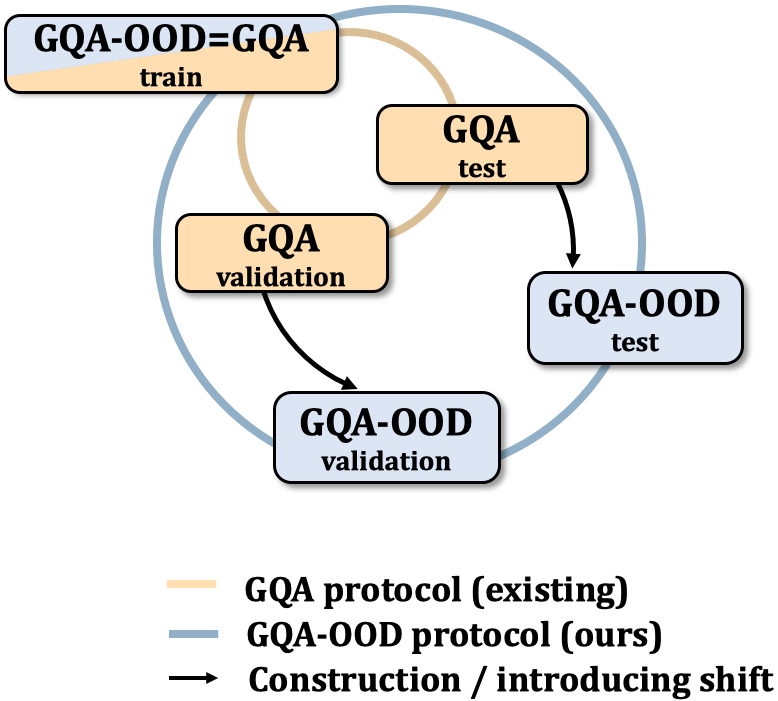
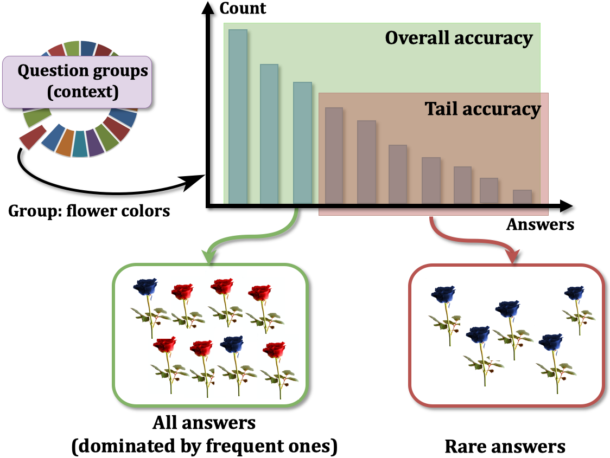
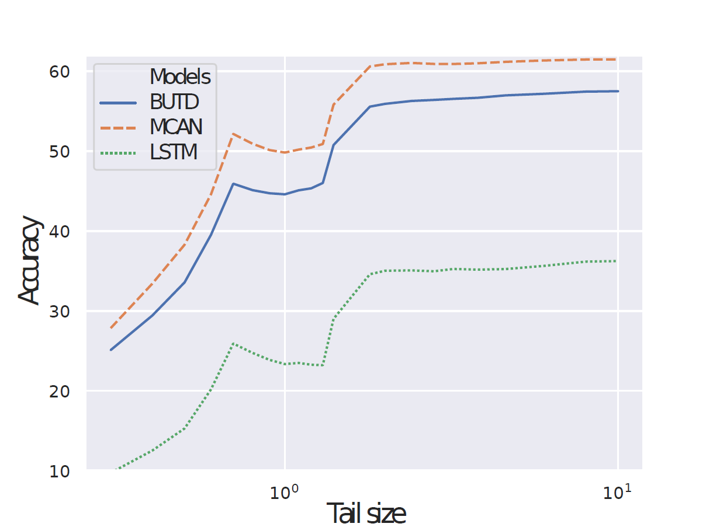
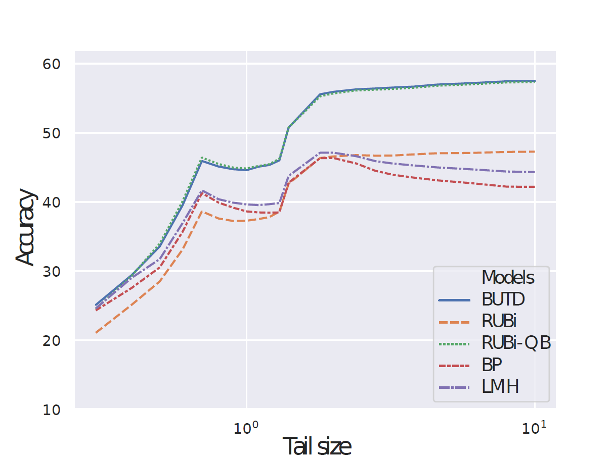

# GQA-OOD (BMVC 2020 Submission)

Here is the GQA-OOD benchmark described in the paper "Roses are Red, Violets are Blue... But Should VQA expect Them To?".

## How is the VQA's prediction error distributed? What is the prediction accuracy on infrequent vs. frequent concepts? 

GQA-OOD is a benchmark based on a fine-grained reorganization of the GQA dataset (https://cs.stanford.edu/people/dorarad/gqa/index.html), which allows to precisely answer these questions. It introduces distributions shifts in both validation and test splits, which are defined on question groups and are thus tailored to each question.

 	
## GQA-OOD evaluation data

GQA-OOD evaluation data are provided in data/. You will find three files for each split (validation and testdev). These files conrrepond to the "all", "head" and "tail" question-anwsers required to compute "acc-all", "acc-head" and "acc-tail".

The evaluation data files respect the GQA annotation format. Therefore, you can directly use the GQA evaluation script provided at https://cs.stanford.edu/people/dorarad/gqa/evaluate.html (by replacing GQA's evaluation datafiles by the GQA-OOD ones). 

## Benchmark

### VQA architectures

We evaluate several VQA architectures on GQA-OOD:

| Model (trained on GQA)         | acc-all      | acc-tail     | acc-head     |
|--------------------------------|--------------|--------------|--------------|
| Quest. Prior                   | 21.6         | 17.8         | 24.1         |
| LSTM                           | 30.7         | 24.0         | 34.8         |
| BUTD [Anderson et al, CVPR 18] | 46.4 +/- 1.1 | 42.1 +/- 0.9 | 49.1 +/- 1.1 |
| MCAN [Yu et al, CVPR 19]       | 50.8 +/- 0.4 | 46.5 +/- 0.5 | 53.4 +/- 0.6 |

#### Accuracy vs. question-answer rareness (rare on the left, frequent on the right)

### VQA bias-reducing techniques

We evaluate on GQA-OOD several VQA methods designed to reduce bias dependacy:

| Technique (trained on GQA)       | acc-all      | acc-tail     | acc-head      |
|----------------------------------|--------------|--------------|---------------|
| BUTD [Anderson et al; CVPR 18]   | 46.4 +/- 1.1 | 42.1 +/- 0.9 |  49.1 +/- 1.1 |
| +RUBi+QB                         | 46.7 +/- 1.3 | 42.1 +/- 1.0 | 49.4 +/- 1.5  |
| +RUBi [Cadene et al, NeurIPS 19] | 38.8 +/- 2.4 | 35.7 +/- 2.3 | 40.8 +/- 2.7  |
| +LMH [Clark et al, EMNLP 19]     | 34.5 +/- 0.7 | 32.2 +/- 1.2 | 35.9 +/- 1.2  |
| +BP [Clark et al, EMNLP 19]      | 33.1 +/- 0.4 | 30.8 +/- 1.0 | 34.5 +/- 0.5  |

#### Accuracy vs. question-answer rareness (rare on the left, frequent on the right)

